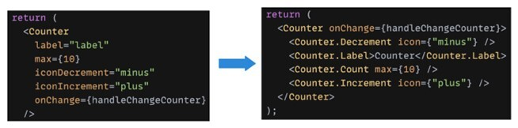

# 리액트 + 타입스크립트 (React +TS)

- 타입스크립트 기초

  - 타입 추론과 명시적 타입

    ```tsx
    // Type inference

    let userName = "Max";
    let userAge = 34;
    ```

    ```tsx
    // Explicit Type

    let isValid: boolean = true;
    ```

  - 기본 타입 (Primitive Type)
    - string, number, boolean
  - 유니온 타입 (Union Type)
    ```tsx
    let userId: string | number = "abc1";
    ```
  - 오브젝트 타입 (Object Type)

    - ‘object’ 타입이 있지만, 이것은 structure를 보여주지 않음

      ```tsx
      // let user: object;
      let user: {
        name: string;
        age: number;
        isAdmin: boolean;
        id: string | number;
      };

      user = {
        name: "Max",
        age: 22,
        isAdmin: true,
        id: "adwb2",
      };
      ```

  - 배열 타입 (Array Type)

    ```tsx
    let hobbies: Array<string>;
    hobbies = ["Soccer", "Cooking", "Reading"];
    // hobbies = [1, 2];

    let hobbies2: string[];
    hobbies2 = ["Soccer", "Cooking", "Reading"];
    ```

  - functions

    ```tsx
    function add(a: number, b: number): void {
      const result = a + b;
      console.log(result);
    }

    // return type inferred
    function add2(a: number, b: number) {
      const result = a + b;
      return result;
    }

    // Function Type
    function calculate(
      a: number,
      b: number,
      **calcFn: (a: number, b: number) => number**
    ) {
      calcFn(a, b);
    }

    calculate(2, 5, add2);
    ```

  - Custom Type

    ```tsx
    type AddFn = (a: number, b: number) => number;

    function calculate(a: number, b: number, calcFn: AddFn) {
      calcFn(a, b);
    }

    type User = {
      name: string;
      age: number;
      isAdmin: boolean;
      id: string | number;
    };

    let user: User;
    ```

  - Interface

    ```tsx
    interface Credentials {
      password: string;
      email: string;
    }

    let creds: Credentials;

    creds = { password: "adslfk", email: "dmd@gmadlkw.com" };
    ```

  - Interface vs. Custom Type

    - interface is limited to object
    - interface cannot store a union type
    - interface is easy to **extend**

    ```tsx
    // 다음과 같은 경우면 인터페이스가 더 나음
    class AuthCredentials implements Credentials {
      email: string; // required by interface
      password: string; // required by interface
      userName: string;
    }

    function login(credentials: Credentials) {}
    login(new AuthCredentials());
    ```

  - Merging types

    ```tsx
    // type 이용

    type Admin = { permission: string[] };
    type AppUser = { userName: string };
    type AppAdmin = Admin **&** AppUser;
    ```

    ```tsx
    // interface 이용

    interface Admin {
      permission: string[];
    }
    interface AppUser {
      userName: string;
    }
    interface AppAdmin **extends** Admin, AppUser {}
    ```

    ```tsx
    let admin: AppAdmin;
    admin = {
      permission: ["login"],
      userName: "admin",
    };
    ```

  - Literal Types

    ```
    let role: "admin" | "user";

    role = "admin";
    role = "user";
    // role = "editor"; error
    ```

  - Adding type guards
    ```tsx
    function performAction(action: string | number, role: Role) {
      if (role === "admin" && typeof action === "string") {
        // ...
      }
    }
    ```
    - allows TS to do Type Narrowing
      - `typeof` check if type is string, number, booleans, object, function, symbol, or bigint
      - `instanceof` check if an object value is based on some specific class
      - `in operator` check if an object contains a specific property
    - typeof 커스텀 타입 체크는 불가 (TS 기능이라)
  - Generic Type

    - Generic type? works together with another type

    ```tsx
    // 함수 아규먼트의 타입 버전
    type DataStorage<T> = { storage: T[]; add: (data: T) => void };

    const textStorage: DataStorage<string> = {
      storage: [],
      add(data) {
        this.storage.push(data);
      },
    };

    const userStorage: DataStorage<User> = {
      storage: [],
      add(user) {},
    };
    ```

    ```tsx
    // Generic Function

    function merge<T, U>(a: T, b: U) {
      return { ...a, ...b };
    }

    const newUser = merge({ name: "Morgan" }, { age: 54 });
    ```

    -

- 리액트 + 타입스크립트

  - 컴포넌트 프롭 타입 정의

    ```tsx
    **type CourseGoalProps = {
      title: string;
      description: string;
    };**

    function CourseGoal(**{ title, description }: CourseGoalProps**) {
      return ();
    }

    export default CourseGoal;
    ```

  - children 프롭 타입

    1. ReactNode 타입을 통해 chlidren을 포함해주거나
    2. PropsWithChildren 타입 내 제네릭 타입만 선언해줘도 됨

    ```tsx
    import { type PropsWithChildren, type ReactNode } from "react";

    type CourseGoalProps1 = {
      title: string;
      children: ReactNode;
    };

    type CourseGoalProps2 = PropsWithChildren<{ title: string }>;

    function CourseGoal({ title, children }: CourseGoalProps) {
      return (...);
    }

    export default CourseGoal;
    ```

  - 리액트가 리스트 iterating에 사용하는 key 프롭은 따로 타입으로 지정해주지 않아도 됨
  -

- interface vs. type

  - interface가 타입 체크는 빠르지만 object, function만 가능
  - 둘 중 하나를 일관적으로 사용하는 게 중요
  - interface는 상속, 선언적 머징이 특징
  - predictability가 더 필요할 때 type을 기본으로 사용, interface는 저런 특징이 필요할 때만 사용하는 게 좋다

  [https://www.youtube.com/watch?v=zM9UPcIyyhQ](https://www.youtube.com/watch?v=zM9UPcIyyhQ)

- Best Practices

  - 1. Strict Mode
    - 컴포넌트의 **프롭** & **스테이트** 타입 명시 (인터페이스 or 타입)
    - 컴파일 타임에 에러 찾아내기
    ```json
    // tsconfig.json
    {
      "compilerOptions": {
        "strict": true
      }
    }
    ```
  - 2. Type Annotations for Props and State

    ```tsx
    interface MyComponentProps {
      name: string;
      age: number;
    }

    interface MyComponentState {
      isOpen: boolean;
    }

    const MyComponent: React.Component<MyComponentProps, MyComponentState> = ({
      name,
      age,
    }) => {
      // Component implementation
    };
    ```

  - 3. Functional Components and React Hooks

    - 클래스 컴포넌트가 아닌 함수 컴포넌트 사용하기
    - 스테이트와 라이프사이클을 관리하기 위해 리액트 훅(e.g., `useState`, `useEffect`) 사용하기

    ```tsx
    import React, { useState, useEffect } from "react";

    interface CounterProps {
      initialCount: number;
    }

    const Counter: React.FC<CounterProps> = ({ initialCount }) => {
      const [count, setCount] = useState(initialCount);

      useEffect(() => {
        // Do something when count changes
      }, [count]);

      return (
        <div>
          <p>Count: {count}</p>
          <button onClick={() => setCount(count + 1)}>Increment</button>
        </div>
      );
    };
    ```

  - 4. Use TypeScript Utility Types

    - 간단한 타입 변형을 위해 TS 유틸리티 타입 활용하기 (`Partial`, `Required`, `Pick`, `Omit`)

    ```tsx
    interface User {
      id: number;
      name: string;
      email: string;
    }

    type PartialUser = Partial<User>; // All properties become optional
    type;

    RequiredUser = Required<User>; // All properties become required
    type UserWithoutEmail = Omit<User, "email">; // Exclude 'email' property
    ```

  - 5. Avoid Any Type

    - 최대한 any 타입 사용 지양하기
    - 타입을 명시하거나 유니온 타입 활용

    ```tsx
    const fetchData = (): Promise<User[]> => {
      // Fetch user data from an API
    };

    const handleData = (data: User[] | null) => {
      // Handle data
    };
    ```

  - 6. Error Handling with Custom Types

    - 비동기 함수 사용시 커스텀 타입으로 다양한 에러 상태 관리

    ```tsx
    type AsyncResult<T, E> = {
      loading: boolean;
      data: T | null;
      error: E | null;
    };

    const fetchUserData = (): AsyncResult<User[], string> => {
      // Fetch user data and handle errors
    };
    ```

  - 7. Use Generic Components

    - 제네릭 컴포넌트 사용으로 타입 재사용성 높이기

    ```tsx
    interface ListItem<T> {
      item: T;
    }

    const ListItemComponent: React.FC<ListItem<User>> = ({ item }) => {
      // Render item
    };
    ```

  - 8. Avoid Unnecessary Type Assertions

    - 불필요한 타입 assertion (as) 지양하고, 타입을 명시

    ```tsx
    const result: number = calculateValue() as number; // Unnecessary type assertion

    const result: number = calculateValue(); // Preferred approach with explicit type
    ```

  - 9. Consistent Naming Conventions

    - 컴포넌트, 프롭, 변수에 대한 네이밍 규칙 일관적으로 따르기

    ```tsx
    interface UserProfileProps {
      user: User;
    }

    const UserProfile: React.FC<UserProfileProps> = ({ user }) => {
      // Component implementation
    };

    const getUserData = (): Promise<User> => {
      // Fetch user data
    };
    ```

  - 10. Use Third-Party Libraries with TypeScript Support
    - TS를 지원하는 써드파티 라이브러리 사용
    ```tsx
    import { Button } from "third-party-library"; // Importing component
    import { User } from "third-party-library/types"; // Importing types
    ```
  - 11. Optimization Techniques
    - `React.memo` 함수 컴포넌트를 메모이제이션하고, 불필요한 리렌더를 막기 위해 Higher Order Component (HOC) 활용
    - `useCallback` 이벤트 핸들러 등을 메모이즈, 함수가 불필요하게 재생성 되는 것 방지
    - `useMemo` expensive한 계산 메모이즈, 중복 계산 방지
    ```tsx
    const MyComponent: React.FC<Props> = React.memo(({ propA, propB }) => {
      // Component implementation
    });
    ```
  - 12. Component Design Patterns
    - 컨테이너 컴포넌트 패턴
      children 프롭을 전달하는 컨테이너 컴포넌트 활용
      데이터 핸들링과 비즈니스 로직을 위한 컨테이너 컴포넌트(Smart 컴포넌트)와 UI 엘레먼트 렌더링을 위한 프레젠테이셔널 컴포넌트(Dumb 컴포넌트) 분리
      - **로더** - 컨테이너는 특정 조건이 true인 동안 로더를 표시하고, 그렇지 않으면 콘텐츠를 렌더링합니다.
      - **인증 게이트** - 사용자가 인증되지 않은 경우 컨테이너는 자식을 렌더링하지 않습니다.
      - **레이아웃 및 스타일 제공 (플레이스홀더)** - 컨테이너는 일관된 스타일을 제공하는 래퍼 역할을 합니다. 콘텐츠가 다른 여러 대시보드 페이지 컴포넌트가 있고, 각 페이지에 동일한 레이아웃을 제공하고 싶을 때 사용합니다.
    - 렌더 프롭 패턴
      프롭으로 JSX를 리턴하는 함수를 넘겨 컴포넌트 간에 코드와 데이터 공유
      [훅으로 대체할 수 있지만, 선택적 렌더링이 필요할 때 여전하 유효한 패턴](https://itchallenger.tistory.com/m/559)
      [렌더 프롭 패턴의 대안?](https://gist.github.com/bradwestfall/4fa683c8f4fcd781a38a8d623bec20e7)
    - 고차 컴포넌트 패턴(HOC)
      기능을 추가하거나 기존 컴포넌트의 행위를 수정하기 위해 HOC 사용
    - 프로바이더 패턴
      많은 컴포넌트에 프롭 드릴링 없이 데이터와 스테이트를 제공하기 위해 리액트 컨텍스트API 활용
    - 컴파운드 컴포넌트 패턴
      UI 엘레먼트 만들 때 일반적으로 사용
      • API 복잡성 감소: 하나의 거대한 부모 컴포넌트에 모든 props를 집어넣고 하위 UI 컴포넌트로 향해 내려가는 대신, 각 prop는 가장 적합한 SubComponent에 연결되어 있습니다.
      • 유연한 마크업 구조: 컴포넌트의 UI가 매우 뛰어난 유연성을 가지고 있고 하나의 컴포넌트로부터 다양한 케이스를 생성할 수 있습니다. 예를 들어, 사용자는 SubComponent의 순서를 변경하거나 이 중에서 무엇을 표시할지 정할 수 있습니다.
      • 관심사의 분리: 대부분의 로직은 기본 Counter 컴포넌트에 포함되며, React.Context는 모든 자식 컴포넌트의 states와 handlers를 공유하는 데 사용됩니다. 따라서 책임 소재를 명확히 분리할 수 있습니다..
      
      
      
      - 너무 높은 UI의 유연성: 유연성이 높다는 것은 예기치 않은 동작을 유발할 가능성이 크다는 것을 의미합니다. 예를 들어, 필요 없는 자식 컴포넌트가 존재하거나, 자식 컴포넌트의 순서가 잘못되어 있을 수 있고, 꼭 필요한 자식 컴포넌트가 없을 수도 있습니다.사용자가 컴포넌트를 어떻게 사용하기를 원하는지에 따라, 유연성을 어느 정도 제한하고 싶을 수도 있습니다.
      - 너무 무거운 JSX: 이 패턴을 적용하면 JSX 행 수가 증가하며, 특히 EsLint와 같은 린터나 Prettier와 같은 코드 포맷터를 사용하는 경우 더욱 심각해집니다.단일 컴포넌트 수준에서는 큰 문제가 아니지만, 규모가 커질수록 그 차이가 확연하게 드러납니다.
        [5가지 최신 고급 리액트 패턴 - ① Compound Component, Control Props, Custom Hook](https://wishket.tistory.com/m/12)
        [5가지 최신 고급 리액트 패턴 - ② Props Getters, State reducer](https://wishket.tistory.com/m/entry/5가지-최신-고급-리액트-패턴-②-Props-Getters-State-reducer)
  - 13. Debounce and Throttle Event Handlers

    - 업데이트가 잦은 이벤트를 다룰 때(스크롤, 리사이즈), 디바운스나 쓰로틀링을 스용해 성능 최적화

    ```tsx
    import { debounce } from "lodash";

    const handleScroll = debounce(() => {
      // Handle scroll event
    }, 200);

    window.addEventListener("scroll", handleScroll);
    ```

  - 14. Conditional Rendering
    - 조건부 렌더링
    ```tsx
    const MyComponent: React.FC<Props> = ({ isLoggedIn }) => {
      return isLoggedIn ? <AuthenticatedComponent /> : <GuestComponent />;
    };
    ```
  - 15. Immutability
    - 스테이트나 프롭 업데이트할 때 불변성의 원칙 따르기. 객체나 배열을 직접 업데이트하니 않고, 스프레드 연산자 등을 이용해 카피 후 변이시키기
    ```tsx
    const updateItem = (index: number, newItem: Item) => {
      const updatedItems = [...items];
      updatedItems[index] = newItem;
      setItems(updatedItems);
    };
    ```
  - Refs
    [Using React with TypeScript: A Comprehensive Guide for Developers](https://www.kodaps.dev/en/blog/using-react-with-typescript-a-comprehensive-guide)
    [Best Practices and Design Patterns for React components in 2023](https://codedamn.com/news/reactjs/best-practices-react)
    [Getting Started with TypeScript for React Applications](https://blog.stackademic.com/typescript-for-react-applications-54b3775acb5e)
